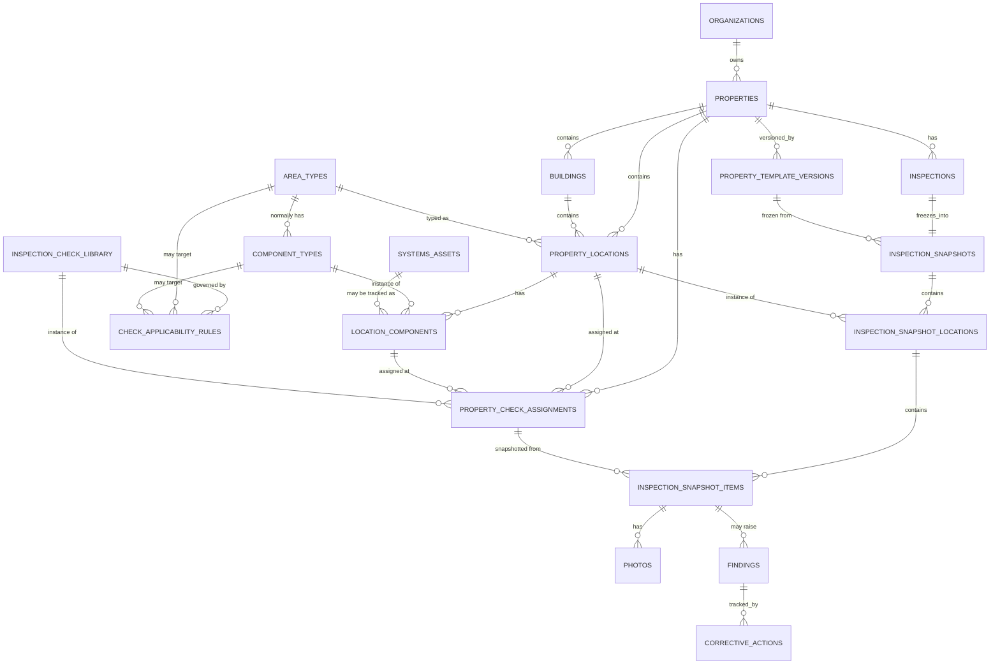

# Database Schema — Capex Inspection Pro

**Status:** Draft v0.2 — Phase 1, companion to `PRODUCT_SPEC.md`. Revises
v0.1 to add (1) a location-driven area/component/inspection-check
hierarchy in place of a flat section/item template, and (2) server-enforced
plan entitlement, device registration, and security infrastructure as MVP
requirements. No tables exist in Supabase yet.

## Conventions (unchanged from v0.1)

- Every tenant-scoped table has `organization_id` and an RLS policy
  restricting access to the caller's own organization.
- Every table has `id uuid primary key default gen_random_uuid()`,
  `created_at timestamptz default now()`, `updated_at timestamptz`.
- Lifecycle uses a `status` column rather than hard deletes, except for
  explicit administrator-only permanent-deletion paths.
- Client-generated UUIDs are used as primary keys for anything created
  offline, so sync is idempotent.
- **New convention for this revision:** any table whose row count is a
  plan entitlement limit (`properties`, `devices`) has `insert` **denied
  entirely** for the `authenticated` role. The only way to create a row is
  through a `SECURITY DEFINER` Postgres function or a server-side Edge
  Function using the service-role key, both of which perform the
  entitlement check and the insert inside one transaction. This is what
  makes the limit unbypassable by a fast client or a concurrent request —
  see "Entitlement Enforcement" below.

---

## Part A — Organizations, plan entitlement, devices, security

### organizations

`id`, `name`, `plan_tier` (`free` / `individual` / `professional` / `team` /
`enterprise`), `property_slot_limit` (int, `1` for free), `device_slot_limit`
(int, `1` for free), `user_seat_limit` (int, `1` for free),
`teammate_invites_allowed` (bool, `false` for free), `plan_limits_extra`
(jsonb — monthly inspections, storage, branded reports, analytics,
retention period; **not enforced in MVP**, reserved for later tiers),
`status` (active/archived), `created_at`.

The four explicit limit columns (as opposed to burying them in jsonb) are
deliberate: the entitlement-enforcing functions below read plain integer
columns under a row lock, which is simpler to reason about and audit than
parsing jsonb inside a security-critical transaction.

### profiles

`id` (= Supabase auth user id), `organization_id`, `full_name`, `email`,
`email_verified_at`, `role` (org_admin / portfolio_manager / supervisor /
inspector / viewer), `mfa_enrolled` (bool), `status`
(active/invited/disabled), `created_at`.

### devices

`id`, `organization_id`, `user_id`, `fingerprint_hash` (text — HMAC-SHA256
of an app-scoped identifier, computed server-side; **never** the raw
identifier), `play_integrity_verdict` (jsonb — last verified verdict +
timestamp + basic integrity/app-recognition/licensing signals only, not
raw device data), `status` (`active` / `revoked`), `registered_at`,
`revoked_at`, `revoked_reason`, `replaced_by_device_id` (nullable,
self-reference). Unique partial index on
`(organization_id, fingerprint_hash) where status = 'active'`.

**What this table intentionally does not contain:** IMEI, Android ID,
serial numbers, MAC addresses, or any other raw hardware identifier. The
only durable value stored is a one-way HMAC digest.

### security_events

`id`, `organization_id` (nullable — some events happen pre-org, e.g. a
rejected signup), `user_id` (nullable), `event_type` (`signup`,
`email_verified`, `login_success`, `login_failed`, `mfa_enrolled`,
`mfa_challenge_failed`, `device_registered`, `device_revoked`,
`device_replaced`, `password_reset_requested`, `rate_limit_triggered`,
`captcha_failed`, `play_integrity_rejected`, `property_slot_denied`,
`device_slot_denied`), `metadata` (jsonb — never raw hardware IDs or full
tokens), `ip_hash` (hashed, not the raw IP), `created_at`.

Kept separate from the general `audit_log` (below) because access to
security events is restricted to `org_admin` only, whereas `audit_log`
(business-data changes) is visible more broadly per the permission matrix.

### audit_log (unchanged in shape from v0.1)

`id`, `organization_id`, `actor_id`, `action`, `entity_type`, `entity_id`,
`before` (jsonb, nullable), `after` (jsonb, nullable), `created_at`. Now
also records: property-slot-limited creation attempts and outcomes,
device-replacement events (cross-referenced with `security_events`), and
critical-check status changes (see Part B).

## Entitlement enforcement (design, implemented in Phase 2/3)

**Property creation — `create_property()` (Postgres, `SECURITY DEFINER`):**

```sql
create or replace function create_property(p_org_id uuid, p_payload jsonb)
returns properties
language plpgsql security definer as $$
declare
  v_limit int;
  v_used int;
  v_row properties;
begin
  -- Row-level lock on the organization prevents two concurrent requests
  -- from both reading "0 used" and both inserting.
  select property_slot_limit into v_limit
    from organizations where id = p_org_id for update;

  select count(*) into v_used from properties
    where organization_id = p_org_id and status in ('active', 'archived');
    -- archived properties still consume the slot, by design

  if v_used >= v_limit then
    insert into audit_log(organization_id, actor_id, action, entity_type)
      values (p_org_id, auth.uid(), 'property_slot_denied', 'properties');
    raise exception 'property_slot_limit_reached';
  end if;

  insert into properties (organization_id, ...) values (p_org_id, ...)
    returning * into v_row;
  return v_row;
end; $$;
```

The `properties` table's own RLS `insert` policy is `false` for
`authenticated` — the **only** path to a new row is this function (or,
for hard administrative overrides, the service role directly). This means
the limit cannot be bypassed by calling the REST/`insert` endpoint
directly, and the `for update` lock closes the race condition where two
concurrent requests each see "0 of 1 used."

**Device registration/replacement — Edge Functions (`register_device`,
`replace_device`):**

These cannot be pure Postgres functions because they must (a) call
Google's Play Integrity API over HTTPS to verify the token, and (b)
compute the HMAC using a secret held only in server-side environment
config. Both run as Supabase Edge Functions using the service-role key
internally (never exposed to the client):

1. Client sends: the app-scoped identifier (see below), a Play Integrity
   token, and (for replacement) the current authenticated session.
2. Edge Function calls Google's Play Integrity verdict endpoint
   server-side and rejects the request if the verdict indicates a
   failed/unrecognized integrity check.
3. Edge Function computes `fingerprint_hash = HMAC-SHA256(app_scoped_id,
SERVER_SECRET)` — the app-scoped id itself is discarded after this,
   never stored.
4. Edge Function opens one transaction that: row-locks the organization
   (`register_device`) or the existing device row (`replace_device`),
   re-checks the entitlement/limit, and performs the insert/update —
   same atomicity guarantee as `create_property()`.
5. `replace_device` additionally: revokes the prior device row
   (`status='revoked'`, `revoked_reason='replaced'`), links it via
   `replaced_by_device_id`, sends a security-notification email, and
   writes a `security_events` row (`device_replaced`).

`devices` RLS `insert`/`update` is likewise `false` for `authenticated` —
only these Edge Functions (via service role) can write to it.

**App-scoped identifier:** on Android, this is an identifier that is
reset on uninstall/reinstall by design (that's what makes it
privacy-respecting rather than a persistent hardware ID) — practically,
Expo's application-instance identifier or an equivalent Firebase
Installation ID. This is a deliberate tension with "reinstall should not
grant a new slot," resolved by the reinstall behavior below rather than by
trying to make the identifier itself persistent.

**Reinstall / "new device" detection (per your decision):** reinstalling
the app generates a new app-scoped identifier, so a returning user's
fingerprint will no longer match their registered device. On the next
successful sign-in (valid credentials, plus MFA if enrolled), the backend
automatically runs the same transactional path as `replace_device` —
revoke old fingerprint, register new one, send a security-notification
email, write `security_events` + `audit_log` entries. The user experiences
this as an ordinary sign-in; the email is the safety net that surfaces an
unexpected replacement if it wasn't actually them. This does **not**
create a new property slot — property entitlement is scoped to the
organization, not the device, and is untouched by this flow.

**Free-plan abuse boundary vs. legitimate paid invites:** the
one-active-device rule and the fingerprint-reuse block are evaluated
specifically at **self-serve free-organization creation** and at
**device registration under a free-plan organization**. Accepting an
invite to an existing organization on a paid plan is a different
transactional path (`accept_invite()`, Phase 3) that checks
`user_seat_limit` and `teammate_invites_allowed` on that organization —
it never consults the free-plan device-fingerprint-reuse check, so a
device that already has one free account cannot be blocked from later
joining a teammate's paid organization.

## Security requirements reflected in schema/design (implemented across Phases 2, 3, 6, 10)

- Verified email required before full access (`profiles.email_verified_at`
  gates permission checks).
- Signup, sign-in, and password-recovery rate limiting plus CAPTCHA/bot
  protection at the Supabase Auth layer (built-in rate limits + hCaptcha/
  Turnstile challenge on signup and recovery).
- Session tokens stored in platform secure storage (Keystore-backed) on
  device, never in plain files or `AsyncStorage`.
- Local SQLite inspection data and cached photos encrypted at rest, with
  the encryption key itself held in secure device storage (specific
  library choice — e.g. SQLCipher-compatible SQLite — finalized in
  Phase 6 alongside the offline sync build-out).
- Administrator (`org_admin`) MFA enrollment required (Supabase Auth
  TOTP), enforced at the RLS/application layer for admin-only actions.
- All Supabase Storage buckets (photos, reports) are **private**; access
  is only ever via short-lived signed URLs (minutes, not persistent
  public links).
- Row Level Security enabled and tested on every tenant-scoped table,
  including the new `devices` and `security_events` tables.
- Approved reports remain immutable (unchanged from v0.1).
- `security_events` gives a queryable audit trail for logins, device
  changes, and abuse signals; `audit_log` covers business-data changes.
- Session/device revocation: an `org_admin` can revoke a `devices` row
  (forcing re-registration) or force-expire a user's Supabase session.
- Backup restoration is tested procedure, not just a scheduled backup
  (see `TEST_PLAN.md`).

---

## Part B — Location-driven checklist hierarchy

Replaces the flat "global template → property template → snapshot" item
list from v0.1 with a compositional model:

**Organization → Property → Building → Area/Location → Component/Asset →
Inspection Check**

### Entity-relationship overview



### area_types

`id`, `organization_id` (nullable = platform standard library), `name`
(entrance, roof, exterior elevation, balcony, hallway, lobby, stairwell,
apartment/unit, basement, boiler room, mechanical room, electrical room,
elevator room, laundry room, garbage/compactor room, storage room,
sidewalk, yard, parking area, custom area), `description`, `is_custom`
(bool), `status`. **Data-driven, not hard-coded** — adding a new standard
area type is a data insert, not an app release.

### component_types

`id`, `area_type_id`, `organization_id` (nullable = platform standard),
`name` (e.g. under Roof: membrane, flashing, drains, strainers, parapets,
coping, bulkhead, skylight, chimney, walk pads, exhaust fans, rooftop
equipment — one row per component per area type per the full library in
`PRODUCT_SPEC.md`), `description`, `is_custom` (bool), `status`.

### property_locations (replaces v0.1's flat `locations`)

`id`, `property_id`, `building_id` (nullable), `area_type_id`,
`parent_location_id` (nullable, self-reference for a sub-location), `name`
(e.g. "Hallway — Floor 2", "Stairwell A", "Roof — Rear Extension"),
`floor` (nullable), `route_order` (int), `status` (active/inactive),
`created_at`. A property may contain any number of instances of the same
`area_type_id`. Each row has its own inspection history via
`inspection_snapshot_locations`.

### location_components

`id`, `property_location_id`, `component_type_id`, `asset_id` (nullable FK
to `systems_assets`, populated when the component is a discrete tracked
asset like a boiler rather than a structural feature like flooring),
`confirmed` (bool — set true when the user confirms it during guided
setup, false while only a suggestion), `status`
(active/inactive/replaced/not_applicable), `notes`.

### systems_assets (unchanged in shape from v0.1)

Full asset detail (manufacturer, serial number, service life, warranty,
PM frequency, next service date, certificate expiration, etc.) —
optionally linked from `location_components.asset_id` when a component
warrants full asset tracking.

### inspection_check_library

`id`, `organization_id` (nullable = platform standard library), `name`
(e.g. "Inspect for punctures, open seams, deterioration, and previous
temporary repairs"), `instructions`, `standard_status_options` (jsonb,
defaults to the 5 states), `photo_required` (bool), `comment_required`
(bool), `measurement_required` (bool), `measurement_unit`,
`acceptable_range_min`, `acceptable_range_max`, `default_priority`,
`default_department`, `frequency`, `critical` (bool — life-safety /
required-by-org, cannot be silently removed), `regional_tag` (nullable),
`seasonal` (bool), `status` (`active` / `inactive` / `not_applicable` /
`superseded`), `status_reason` (required when status is not `active`),
`status_changed_by`, `status_changed_at`, `superseded_by_check_id`
(nullable, self-reference), `version_number`.

Critical-check governance: an ordinary template edit can never hard-delete
or silently deactivate a row where `critical = true`. Any transition away
from `active` requires `status_reason` and is written to `audit_log`
(who, when, why); org-admin approval is required for critical-check
deactivation (enforced in the update path/RLS, not just the UI).

### check_applicability_rules

`id`, `inspection_check_id`, `area_type_id` (nullable), `component_type_id`
(nullable), `asset_category` (nullable), `inspection_type` (nullable),
`region_tag` (nullable), `season` (nullable), `frequency` (nullable),
`property_id` (nullable — property-specific override/inclusion rather
than a general rule), `rule_type` (`include` / `exclude`), `notes`. This
is what the generator evaluates to decide which checks apply where.

### property_check_assignments (the resolved, editable property checklist)

`id`, `property_id`, `property_location_id`, `location_component_id`
(nullable — some checks apply at the location level generally, e.g.
"general area cleanliness," without a specific component), `inspection_check_id`,
`source_rule_id` (nullable FK to `check_applicability_rules` — null if
manually added by a user rather than rule-generated),
`override_priority` (nullable), `override_department` (nullable), `status`
(`active` / `inactive` / `not_applicable` / `superseded`), `status_reason`
(required when not active), `created_by`, `created_at`. **Unique
constraint** on `(property_id, property_location_id, location_component_id,
inspection_check_id)` where `status = 'active'` — this is the
duplicate-prevention rule the generator relies on.

### property_template_versions

`id`, `property_id`, `version_number`, `assignments_snapshot` (jsonb —
frozen copy of the resolved `property_check_assignments` at the moment the
property checklist was activated/saved, for history and diffing),
`created_by`, `created_at`, `change_summary`, `status` (draft/active).

### inspections (header/scheduling record — mutable)

`id`, `organization_id`, `property_id`, `inspection_type`,
`assigned_inspector_id`, `scheduled_date`, `status`
(scheduled/in_progress/completed/postponed/voided), `scope_selection`
(jsonb — which buildings/locations were selected for this run, per the
inspection-type scope rules below), `created_at`, `completed_at`.

### inspection_snapshots (immutable freeze — 1:1 with inspections)

`id`, `inspection_id`, `property_template_version_id`, `generated_at`,
`generated_by`. This is what guarantees a later property-template edit
never alters an in-progress or completed inspection: the snapshot points
at a specific frozen version, not the live `property_check_assignments`.

### inspection_snapshot_locations

`id`, `inspection_snapshot_id`, `property_location_id`, `sequence_order`,
`status` (`pending` / `in_progress` / `complete` / `skipped` /
`inaccessible` / `not_applicable`), `status_reason` (**required** when
status is `skipped`, `inaccessible`, or `not_applicable`, or when an item
under it ends up `not_inspected`), `started_at`, `completed_at`.

### inspection_snapshot_items (replaces v0.1's `inspection_items`)

`id`, `inspection_snapshot_location_id`, `property_check_assignment_id`
(nullable if ad hoc), `inspection_check_id`, `title`/`instructions`
(copied at snapshot time), `location_component_id` (nullable), `status`
(satisfactory/deficiency/not_applicable/not_inspected/pending_verification),
`observation`, `recommendation`, `measurement_value`, `measurement_unit`,
`code_reference`, `priority`, `responsible_department`,
`responsible_person_id`, `vendor_id`, `access_status`, `access_plan`,
`target_completion_date`, `next_action`, `follow_up_date`,
`work_order_number`, `estimated_cost`, `actual_cost`, `labor_hours`,
`material_cost`, `inspected_at`, `is_ad_hoc` (bool),
`ad_hoc_approval_status` (nullable: pending/approved/rejected),
`client_uuid` (offline idempotent sync key), `sync_status`.

### photos / findings / corrective_actions / vendors / reports / audit_log

Unchanged in shape from v0.1, except `photos` and `findings` now
reference `inspection_snapshot_items.id` instead of the old
`inspection_items.id`.

## Duplicate prevention

Two layers: (1) `property_check_assignments` has the unique constraint
above, so the property-level checklist itself cannot contain the same
(location, component, check) combination twice; (2) generating an
inspection snapshot copies each active `property_check_assignments` row
exactly once into `inspection_snapshot_items`, scoped to whichever
locations were selected for that inspection's type — so the generator
cannot produce duplicates even when regional/seasonal rules and manual
overrides overlap.

## How inspection-type scope selection works

`inspections.scope_selection` records which `property_locations` (and by
extension which `location_components`) are in scope for a given run,
computed from `inspection_type` against `property_locations.area_type_id`
and `location_components` — e.g. "roof inspection" resolves to locations
whose `area_type_id` = Roof (plus any `check_applicability_rules` tagged
for relevant exterior conditions); "follow-up inspection" instead resolves
its item list from open `findings`/`corrective_actions` rather than from
area type at all. The full mapping per inspection type is specified in
`PRODUCT_SPEC.md` section 8.

## Migration History

No migrations yet. First migration set (Phase 2/3) will include, in
order: organizations/profiles/devices/security_events →
properties (with `create_property()`) → buildings/property_locations →
area_types/component_types/location_components/systems_assets →
inspection_check_library/check_applicability_rules/
property_check_assignments/property_template_versions → inspections/
inspection_snapshots/inspection_snapshot_locations/
inspection_snapshot_items → photos/findings/corrective_actions/vendors/
reports/audit_log.
